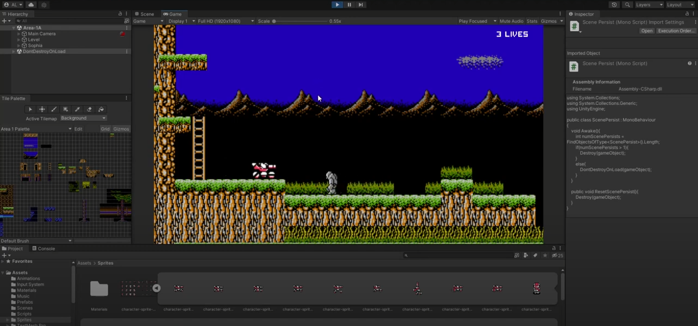

# Blaster Master - 2D Game in Unity/C#

This game was created as part of the Tilevania chapter of GameDev.tv's Unity 2D Games course. Used sprite sheets and assets from [The Spriter's Resources](https://www.spriters-resource.com/) for tilemaps and animations. 

[Demo Video on YouTube](https://www.youtube.com/watch?v=puzG36l9mDQ)

